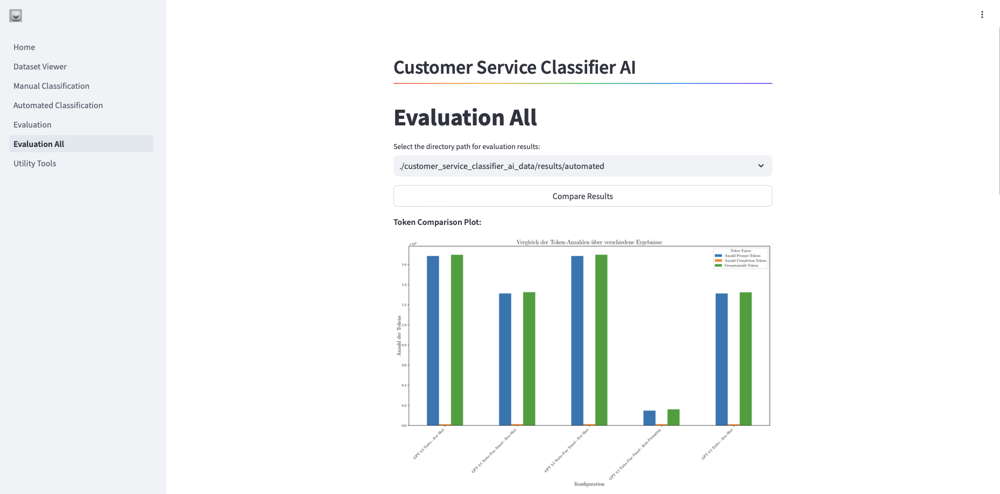

# Customer Service Classifier AI

<div style="text-align: center;">
  
</div>

## Introduction

CustomerServiceClassifierAI is an advanced research project exploring the effectiveness of Large Language Models (LLMs) in classifying customer inquiries in the banking sector. This project employs experimental approaches with prompt-engineering and model fine-tuning techniques, aiming to enhance customer service through precise inquiry classification.

<div style="text-align: center;">
  
</div>

## Features

- Utilizes (BANKING77) a high-quality labeled dataset of banking customer inquiries to verify classification accuracy.
- Implements Zero-Shot and Few-Shot prompting to optimize response quality with no or minimal example inputs.
- Adjusts the LLM using specific dataset segments to increase the precision of model predictions.
- Uses standardized machine learning metrics to objectively assess prototype performance.
- Assesses the cost-effectiveness of the employed techniques.
- Used Models are OpenAIs GPT-3.5 Turbo.

## Objective:

The project aims to enhance customer interactions and provide strategic insights into the feasibility and effectiveness of LLMs in customer communication using cutting-edge AI technologies. It targets developers, researchers, and customer service professionals looking to innovate at the technology frontier.

## Results:

All Results can be found under the folder data/banking_results

## Getting Started

### Tech-Stack

#### General

- [Git](https://git-scm.com) [Version Control]
- [GitHub](https://github.com/) [Code Hosting]

#### Application

- [Python](https://www.python.org/downloads/) [Programming Language]
- [Streamlit](https://www.typescriptlang.org/) [Programming Language]
- [OpenAI GPT](https://openai.com/) [Language Processing]

### Prerequisites

- [Git](https://git-scm.com/downloads)
- [Python](https://www.python.org/downloads/)

---

### Installation

#### Clone

```bash
https://github.com/kamyabnazari/customer-service-classifier-ai
```

#### Setup

### Environment variables

Create a `.env` file in the root of the backend directory with the following variables:

```
OPENAI_API_KEY={your openai api key}
```

### Running the backend

To install the required packages for this service, run the following commands:

```
pip install -r requirements.txt

or

pip3 install -r requirements.txt
```

To run this service, run the following commands:

```
streamlit run app/main.py
```

---

### License

This project is licensed under the [CC-BY-4.0] License - see the LICENSE file for details.

---

### Acknowledgments

Special thanks to the OpenAI team for providing the API that powers our intelligent agents.

Additionally for the dataset by [PolyAI]("https://github.com/PolyAI-LDN/task-specific-datasets")

### Citation

If you want to cite this prototype and the bachelor thesis us the following citation.

```
@misc{Nazari2024,
  author = {Kamyab Nazari},
  title = {Verbesserung des Kundenservices mittels großer Sprachmodelle: Eine tiefgehende Untersuchung zur Klassifizierung von Kundenanfragen},
  year = {2024},
  howpublished = {\url{https://github.com/kamyabnazari/customer-service-classifier-ai}},
  note = {Zugriff am: 16. Juli 2024}
}
```
